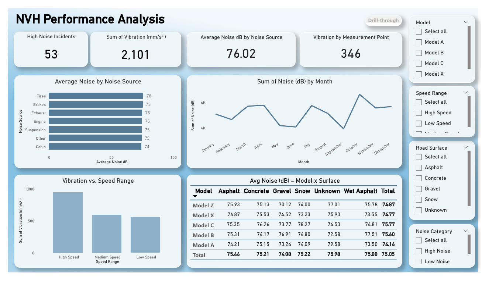

# Synthetic NVH Dataset for Power BI Analysis

This repository contains a synthetic dataset simulating NVH (Noise, Vibration, Harshness) data for automotive performance analysis. The data was intentionally injected with common real-world issues such as missing values, duplicate entries, inconsistent text formats, and outlier readings.

## Objectives

- Simulate real-world NVH data problems for data cleaning practice.
- Demonstrate preprocessing steps in Python (for enhanced performance) to prepare clean, structured data for Power BI.
- Improve Power BI performance by handling transformations externally.

## Process Summary

1. **Data Generation**: Created a synthetic dataset using Python, incorporating noise level (dB), vibration magnitude, customer feedback, road surface type, vehicle metadata, and more.

2. **Error Injection**: Added random nulls, duplicates, inconsistent text casing, typos, and numerical outliers to mimic dirty data.

3. **Preprocessing using Power BI & Enhanced version in (Python)**:
   - Removed duplicates and invalid entries
   - Replaced missing values with medians or placeholders
   - Normalized text fields
   - Created calculated columns for categories like Noise_Level, Speed_Range, Harshness_Rating
   - Built star schema tables (`Fact_NVH_Readings`, `Dim_Vehicle`, `Dim_Location`, `Dim_Component`)

4. **Output**: Cleaned datasets exported as CSVs and ready for loading into Power BI for interactive dashboarding.

---

Built for showcasing data cleaning, modeling, and dashboard development.

## Dashboard Preview

 
 
 

